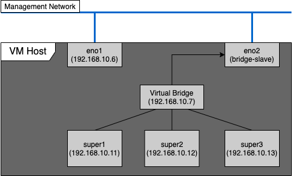
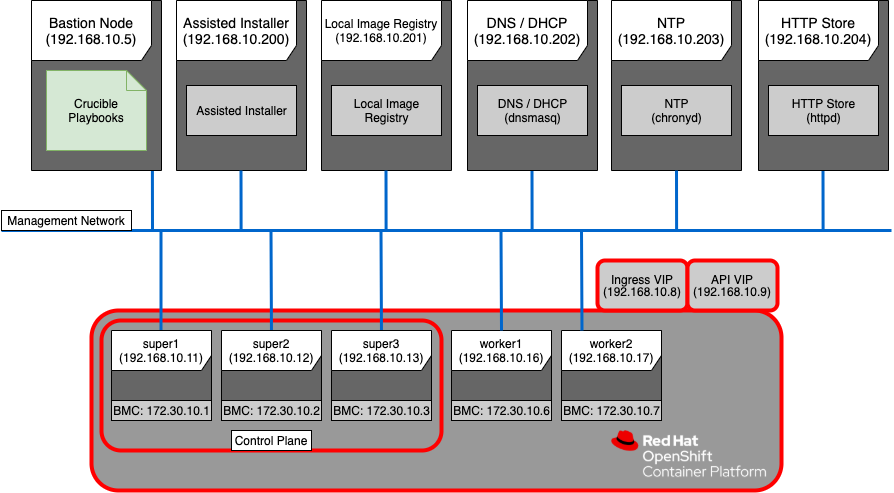

# Crucible | Inventory

> ❗ _Red Hat does not provide commercial support for the content of this repo. Any assistance is purely on a best-effort basis, as resource permits._

---

```bash
##############################################################################
DISCLAIMER: THE CONTENT OF THIS REPO IS EXPERIMENTAL AND PROVIDED "AS-IS"

THE CONTENT IS PROVIDED AS REFERENCE WITHOUT WARRANTY OF ANY KIND, EXPRESS OR
IMPLIED, INCLUDING BUT NOT LIMITED TO THE WARRANTIES OF MERCHANTABILITY,
FITNESS FOR A PARTICULAR PURPOSE AND NONINFRINGEMENT.
##############################################################################
```

---

## Inventory Validation

### Cluster config checks:

- 3 or more master nodes
- 2 or more, or 0 worker nodes
- every node has required vars:
  - `bmc_address`
  - `bmc_password`
  - `bmc_user`
  - `vendor`
  - `role`
  - `mac`
- required vars are correctly typed
- all values of `vendor` are supported
- all values of `role` are supported
- If any nodes are virtual (vendor = KVM) then a vm_host is defined

There three possible groups of nodes are `masters`, `workers` and `day2_workers`.

#### Day 2 nodes

Day 2 nodes are added to an existing cluster. The reason why the installation of day 2 nodes is built into the main path of our automation is that for assisted installer day 2 nodes can be on a different L2 network which the main flow does not allow.

Add a second iso name parameter to the inventory to avoid conflict with the original:

```yaml
# day2 workers require custom parameter
day2_discovery_iso_name: "discovery/day2_discovery-image.iso"
```

Then add the stanza for day2 workers:

```yaml
day2_workers:
  vars:
    role: worker
    vendor: HPE
  hosts:
    worker3: # Ensure this does not conflict with any existing workers
      ansible_host: 10.60.0.106
      bmc_address: 172.28.11.26
      mac: 3C:FD:FE:78:AB:05
```

### Network checks

- All node `bmc_address`es are reachable
- All prerequisite services `ansible_host`s are reachable
- If `setup_ntp_service` is disabled then the configured `ntp_server` must be reachable.

Note that checks on DNS, registry, and HTTP Store are completed later in the playbooks.

> :warning: **If you have dhcp entries already specified then the host name must match the hostname in the dhcp entry. If not procedures will fail**

### VM spec config

The specs of VMs created by the playbooks are configured for every node group. The parameters of the VMs can be specified by adding `vm_spec` to the node definition in the inventory.
A basic example is as follows:

```yaml
vm_spec:
  cpu_cores: 4
  ram_mib: 6144
  disk_size_gb: 20
```

If you wish to configure extra disks then you can add the `extra_disks` keyword:

```yaml
vm_spec:
  cpu_cores: 4
  ram_mib: 6144
  disk_size_gb: 20
  extra_disks:
    my_extra_disk: 100
    my_other_extra_disk: 150
```

Here we specify 2 extra disks of size `100` and `150GB` respectively.

### Required secrets

#### Prerequisite services

The Container Registry service requires the following variables to be set. Set the appropriate values in the inventory vault file.

- `REGISTRY_HTTP_SECRET`

For Restricted Network installations, additional credentials for the registry need to be provided.

- `disconnected_registry_user`
- `disconnected_registry_password`

#### Nodes

All nodes must have credentials set for the BMCs.

- `bmc_user`
- `bmc_password`

It is possible to specify different credentials for individual nodes.
See the sample inventory file (`inventory.yml.sample`) and the sample inventory vault file (`inventory.vault.yml.sample`) for more information.

## Configurations

### Network configuration

The `network_config` entry on a node is a simplified version of the `nmstate`([nmstate.io](http://nmstate.io/)) required by the [assisted installer api](https://github.com/openshift/assisted-service/blob/3bcaca8abef5173b0e2175b5d0b722e851e39cee/docs/user-guide/restful-api-guide.md).
If you wish to use your own template you can set `network_config.template` with a path to your desired template the default can be found [here](../roles/generate_discovery_iso/templates/nmstate.yml.j2). If you wish to write the `nmstate` by hand you can use the `network_config.raw`.

### Static IPs

To activate static IPs in the discovery iso and resulting cluster there is some configuration required in the inventory.

```yaml
network_config:
  interfaces:
    - name: "{{ interface }}"
      mac: "{{ mac }}"
      addresses:
        ipv4:
          - ip: "{{ ansible_host}}"
            prefix: "{{ mask }}"
  dns_server_ips:
    - "{{ dns }}"
    - "{{ dns2 }}"
  routes: # optional
    - destination: 0.0.0.0/0
      address: "{{ gateway }}"
      interface: "{{ interface }}"
```

where the variables are as follows:

- `ip`: The static IP is set
- `dns` & `dns2`: IPs of the DNS servers
- `gateway`: IP of the gateway
- `mask`: Length of subnet mask (e.g. 24)
- `interface`: The name of the interface you wish to configure
- `mac`: Mac address of the interface you wish to configure

#### Link Aggregation

Here is an example of how to do link aggregation of two interfaces.

```yaml
network_config:
  interfaces:
    - name: bond0
      type: bond
      state: up
      addresses:
        ipv4:
          - ip: 172.17.0.101
            prefix: 24
      link_aggregation:
        mode: active-backup
        options:
          miimon: "1500"
        slaves:
          - ens7f0
          - ens7f1
    - name: ens1f0
      type: ethernet
      mac: "40:A6:B7:3D:B3:70"
      state: down
    - name: ens1f1
      type: ethernet
      mac: "40:A6:B7:3D:B3:71"
      state: down
  dns_resolver_ip: 10.40.0.100
  routes:
    - destination: 0.0.0.0/0
      address: 172.17.0.1
      interface: bond0
```

### Prerequisites

---

Use the following vars to control setup of prerequisites:

- `setup_ntp_service`
- `setup_registry_service`
- `setup_http_store_service`
- `setup_dns_service`
- `create_vms`
- `setup_sushy_tools`

Note that if one or more of these services is pre-existing in your environment the inventory must still be configured with information needed to access those services, even when the service is not being set up by the playbooks.

> TODO: list required vars for each service when setup automatically

> TODO: list required vars for each service when NOT setup automatically

### Virtual Nodes

---

When using one or more virtual nodes, they are identified as such by having `vendor` set to `KVM`. They still require the BMC configuration and MAC+IP addresses common to all nodes, but with a few variations:

- The BMC address of the virtual nodes must point to the `vm_host` defined on the node; `sushy-tools` will be set up on the `vm_host` to allow the VMs to be controlled identically to the baremetal hosts.
  - The BMC user and password will be set in `sushy-tools` and must therefore be the same for all virtual nodes.
- The specified MAC address will be set on the VM interface.

### SSH Key Gen

---

By default an SSH key will be generated by the `deploy_cluster.yml` playbook. This can be disabled by adding `generate_ssh_keys = False` to the inventory. It is possible to configure the task generating the SSH key (see the docs for `community.crypto.openssh_keypair`) by setting `openssh_keypair_args` with a dictionary.

# Examples

## Virtual Management Cluster

One of the simplest examples is a simple cluster with no workers, virtual masters on a VM Host, and all other supporting services being configured on the bastion host. The initial environment will be something like this:


That diagram gives the following excerpt from the inventory for the `bastion` and `services`:

> **Note**: We use `ansible_connection: local` here because crucible should be executed from the bastion, the use of connection local removes the need to configure your user to be able to SSH into its self. 

```yaml
# ...
  children:
    bastions:
      hosts:
        bastion:
          ansible_host: 192.168.10.5
          ansible_connection: local

    services:
      hosts:
        assisted_installer:
          ansible_host: "{{ hostvars['bastion']['ansible_host'] }}"
          ansible_connection: local

          # ...
        registry_host:
          ansible_host: "{{ hostvars['bastion']['ansible_host'] }}"
          ansible_connection: local

          # ...
        dns_host:
          ansible_host: "{{ hostvars['bastion']['ansible_host'] }}"
          ansible_connection: local

          # ...
        http_store:
          ansible_host: "{{ hostvars['bastion']['ansible_host'] }}"
          ansible_connection: local

          # ...
        ntp_host:
          ansible_host: "{{ hostvars['bastion']['ansible_host'] }}"
          ansible_connection: local

          # ...
    vm_hosts:
      hosts:
        vm_host:
          ansible_host: 192.168.10.6
          # ...
```

### VM Host in Detail

The virtual `master` nodes in their simplest case are defined in the inventory as an address they will be accessible on, and the MAC Address that will be set when creating the VM and later used by Assisted Installer to identify the machines:

```yaml
        masters:
          vars:
            role: master
            vendor: KVM
            bmc_address: 192.168.10.6:8082 # virtual BMC is setup on VM Host port 8082
          hosts:
            super1:
              ansible_host: 192.168.10.11
              mac: "DE:AD:BE:EF:C0:2C"
            super2:
              ansible_host: 192.168.10.12
              mac: "DE:AD:BE:EF:C0:2D"
            super3:
              ansible_host: 192.168.10.13
              mac: "DE:AD:BE:EF:C0:2E"
```

For the virtual bridge configuration, in this example interface `eno1` is used for accessing the VM host, the `eno2` is assigned to the virtual bridge to allow the virtual `super` nodes to connect to the Management Network. Note that these two interfaces cannot be the same. DNS on the virtual bridge is provided by the DNS `service` configured on the Bastion host.

The `vm_host` entry in the inventory becomes:

```yaml
        vm_host:
          ansible_user: root
          ansible_host: 192.168.10.6
          vm_bridge_ip: 192.168.10.7
          vm_bridge_interface: eno2
          dns: "{{ hostvars['dns_host']['ansible_host'] }}"
```



### Resulting Cluster

Combining those pieces, along with other configuration like versions, certificates and keys, will allow Crucible to deploy a cluster like this:


## Bare Metal Deployment

At the other extreme to the previous example, services and nodes can be spread across multiple different machines, and a cluster with worker nodes can be deployed:



The basic network configuration of the inventory for the fully bare metal deployment environment might look like this:

```yaml
# ...
  children:
    bastions:
      hosts:
        bastion:
          ansible_host: 192.168.10.5
    services:
      hosts:
        assisted_installer:
          ansible_host: 192.168.10.200
          # ...
        registry_host:
          ansible_host: 192.168.10.201
          # ...
        dns_host:
          ansible_host: 192.168.10.202
          # ...
        http_store:
          ansible_host: 192.168.10.204
          # ...
        ntp_host:
          ansible_host: 192.168.10.203
          # ...
        # no vm_host.
    masters:
      vars:
        role: master
        vendor: SuperMicro
      hosts:
        super1:
          ansible_host: 192.168.10.11
          bmc_address: 172.30.10.1
          # ...
        super2:
          ansible_host: 192.168.10.12
          bmc_address: 172.30.10.2
          # ...
        super3:
          ansible_host: 192.168.10.13
          bmc_address: 172.30.10.3
          # ...
    workers:
      vars:
        role: worker
        vendor: Dell
      hosts:
        worker1:
          ansible_host: 192.168.10.16
          bmc_address: 172.30.10.6
          # ...
        worker2:
          ansible_host: 192.168.10.17
          bmc_address: 172.30.10.7
          # ...
```

> **Note**: that the BMCs of the nodes in the cluster must be routable from the bastion host and the HTTP Store must be routable from the BMCs

These two examples are not the only type of clusters that can be deployed using Crucible. A hybrid cluster can be created by mixing virtual and bare metal nodes.
