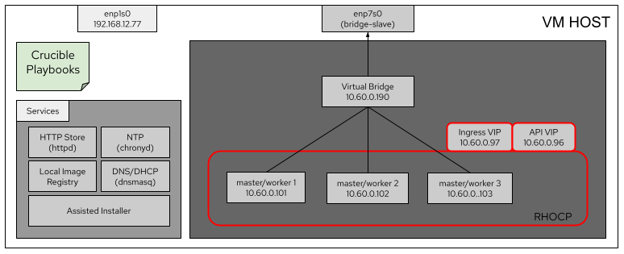

# Installing a fully virtualized RHOCP cluster using crucible

This document gives the instructions to install an OpenShift cluster in a fully virtualized 
environment using crucible.

## Scenario

The OpenShift cluster will be installed using virtual nodes within a VM with nested virtualization 
support. Please check [the guide to setup the VM](how_to_configure_bastion_vm.md)

Assumptions:
- All the services will be installed in the VM Host:
    - HTTP Store
    - NTP Server
    - Local Image Registry
    - DNS/DHCP
    - Assisted Installer

## Install the RHOCP cluster

### Download crucible 

On your VM, download the crucible project in your home

> $ cd ~
> 
> $ git clone https://github.com/redhat-partner-solutions/crucible.git

### Download the pull secret

Please [download](https://console.redhat.com/openshift/install/metal/installer-provisioned)
the pull secret and place it at your home directory with the name "pull-secret"

### Create the scenario files

Create the inventory.vault.yml file

> $ cd ~/crucible/scenarios/all_in_one/
> 
> $ cp inventory.vault.yml.sample inventory.vault.yml

Create the inventory.yml file

> $ cd ~/crucible/scenarios/all_in_one/
> 
> $ cp inventory.yml.sample inventory.yml

### Encrypt your sensitive information

Edit the `~/crucible/scenarios/all_in_one/inventory.vault.yml` file, add your sensitive
information en encrypt it using ansible-vault.

> $ ansible-vault encrypt ~/crucible/scenarios/all_in_one/inventory.vault.yml

### Prepare the inventory file

There is a sample inventory file in `~/crucible/scenarios/all_in_one/inventory.yml`. If you change
the `cluster_name` and `base_dns_domains`, be sure to change `registry_fqdn` and `bmc_address` variables 
accordingly.

    Example values:

    cluster_name: clustername
    base_dns_domain: example.lab
    registry_fqdn: clustername.example.lab
    bmc_address: "clustername.example.lab:8082"

## Execute the scenario specific playbook

Execute the `~/crucible/scenarios/all_in_one/all_in_one.yml` playbook to install all the required dependencies 
and run scenario-specific steps.

> $ cd ~/crucible/scenarios/all_in_one
> $ ansible-playbook -i inventory.yml all_in_one.yml --ask-vault-pass -e '@inventory.vault.yml'

These are the steps that are automated. Some of them mentioned in [the crucible README file](../../../README.md)

### 01_users.yml

- Adds the crucible user to the crucible group

### 02_packages.yml

- Prints the python version, which should be 3.6.8 or higher
- Installs package dependencies
   - python3-netaddr 
   - skopeo 
   - podman

### 03_openshif_client

- Register with Red Hat Subscription Manager
- Verify that the following Red Hat Repository is enabled:
  - rhocp-4.9-for-rhel-8-x86_64-rpms
- Install openshift-clients package

### 04_all_in_one_specific.yml

- Installs virt-manager packages
  - python3
  - libvirt
  - virt-install
  - qemu-kvm
  - virt-manager
  - python3-pip
  - python3-lxml
  - python3-libvirt
- Starts livbirtd service
- Updates /etc/libvirt/qemu.conf
  - Adds user = "redhat"
  - Adds group = "crucible"
- Restarts livbirtd service
- Updates firewall policies
- Restarts firewalld service

### 05_configure_crucible.yml

- Copy the pull secret in the crucible folder and rename it
- Install required Ansible collections

## Run crucible

> $ cd ~/crucible
> 
> $ ansible-playbook -i scenarios/all_in_one/inventory.yml site.yml --ask-vault-pass -e '@scenarios/all_in_one/inventory.vault.yml'